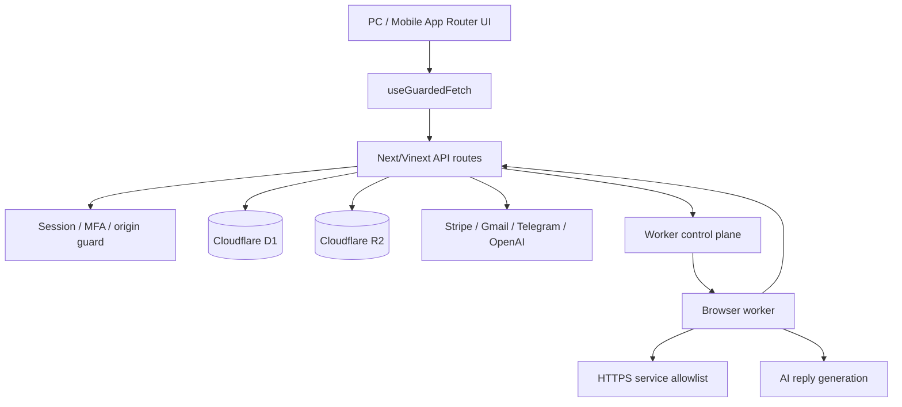

# MatchPilot Personal 証拠ベース厳格監査

実行日: 2026-08-29 (Asia/Tokyo)

リポジトリ: https://github.com/skgroupco9-sudo/matching-autopilot

監査ブランチ: `feature/qa-audit-2026`

基点コミット: `bbdeae59c9b3ae26ee74187de55dcb9c2c7558a2`

監査済み実装コミット: `a492c9d`

## A. 結論

**判定: 条件付き NO-GO（コード品質・セキュリティ・E2E は GO、Lighthouse 95 ゲートだけ未達）**

- 既知の Critical / High 未修正バグ: **0件**。
- 検出10件: High 4、Medium 4、Low 2。すべて監査ブランチで修正済み。
- `pnpm check`: PASS。型、ESLint、静的セキュリティ、1万件ファズ、ドメインテスト、ワーカーを含む Node test は **90/90 PASS**。
- Cloudflare preview の Playwright: PC / モバイル合計 **20/20 PASS**。
- `pnpm audit --prod`: **既知脆弱性0件**。
- `pnpm build`: **PASS**。
- Lighthouse: 公開版 82 / 96 / 77、修正後ローカル production 94 / 100 / 96。Performance だけ目標95に1点届いていない。
- 監査ブランチを公開環境へ配備していないため、Cloudflare圧縮後の正しい After 値は未測定。よって「全項目95以上」や「バグゼロ」を断定しない。

リリース判断は、監査ブランチのpreview deploy後に同一Lighthouseを実行し、Performance / Accessibility / Best Practices がすべて95以上になった時点で GO へ更新する。

## B. 監査範囲と実施内容

### B-1. コードベース

- 主要ソース238ファイルを列挙し、App Routerページ、クライアントコンポーネント、API、lib、worker、DB/schema、tests、scriptsを監査。
- mutation routeファイル47件を静的列挙。各exportは次のいずれかを必須化した。
  - ブラウザ同一生成元検証
  - Stripe / Telegram署名検証
  - user-scoped worker認証
- 基点との差分: 46ファイル、1,700追加、186削除（レポート作成前）。

主要依存関係は Next.js 16.3.2、React 19.2.8、Vinext 1.0.0-beta.8、Drizzle ORM 0.45.2、TypeScript 5.9.3、Playwright 1.62系、Lighthouse 13.4.1。

### B-2. 人格別・異常系

- A 悪意のある入力: script、SQL文字列、path traversal、javascript URL、Origin欠落直接POST、秘密値パターンを検査。
- B 誤操作: 20連打、5タブ同時状態、通信中遷移をPC / モバイルで検査。
- C 異常入力: 空値、10万文字、絵文字、補助平面漢字、Unicode正規化・方向上書き文字を実行。
- D 外部要因: offline、10秒遅延、HTTP 429 / 500 / 503、Asia/Tokyo、ja-JP、Cloudflare binding環境を実行。
- 1万件シミュレーションは「脳内」ではなく、決定的な自動ファズとして実行した。

### B-3. 状態競合

- 同一method / URL / 完全一致bodyの通信をsingle-flight化。
- 文字列bodyは完全一致、URLSearchParamsは正規化文字列、FormData / Blob等はオブジェクト同一性で識別。
- 共有レスポンスは`Response.clone()`で各呼び出しへ返却。
- 画面離脱時Abort、30秒timeout、呼び出し元AbortSignal中継を実装。
- 20連打はネットワークmutation 1回、完了までdisabled、PC / モバイルPASS。

## C. 発見バグと修正

完全な指定JSONは [qa-bugs.json](./qa-bugs.json) に保存した。

| ID | 初期重大度 | 状態 | 修正 |
|---|---:|---|---|
| BUG-001 | High | 修正済み | Origin / Sec-Fetch-Siteを証明できないmutationを403拒否。Gmail connect/codes/disconnectも共通guardへ統一 |
| BUG-002 | High | 修正済み | 重複要求を共有Promiseへ合流し、二重finallyによるbusy解除を防止 |
| BUG-003 | High | 修正済み | 全クライアントAPIへ30秒timeout、Abort、回復可能な日本語エラーを追加 |
| BUG-004 | High | 修正済み | dashboardのGmail / Telegram設定判定をCloudflare envへ修正 |
| BUG-005 | Medium | 修正済み | Unicodeコードポイント長、NFKC、制御文字・方向上書き除去を共通化 |
| BUG-006 | Medium | 修正済み | 全編集可能input / textareaへ上限を静的検査。APIキーは256文字 |
| BUG-007 | Medium | 修正済み | password labelと表示切替buttonを分離し、アクセシブル名衝突を解消 |
| BUG-008 | Medium | 修正済み | ダークモード認証エラーのコントラストを修正。Accessibility 100 |
| BUG-009 | Low | 修正済み | 固定テーマ初期化からdangerouslySetInnerHTMLと外部同期requestを排除 |
| BUG-010 | Low | 修正済み | Lighthouse runnerのESM importとWindows EPERM後処理を修正 |

Reactの通常テキスト描画は標準でescapeされ、利用者入力を挿入するraw HTML sinkは0件だった。そのためDOMPurifyを全入力へ機械的に追加するのではなく、raw HTML API自体を排除した。

## D. 証拠・テスト結果

生ログと全コマンドは [qa-command-log.md](./qa-command-log.md) に保存した。

### D-1. 最終結果

| 検査 | 結果 |
|---|---:|
| TypeScript | PASS |
| ESLint | PASS |
| セキュリティ基盤 | 6/6 PASS |
| 1万件 hostile / Unicode fuzz + 静的QA | 4/4 PASS |
| Telegram学習 | 18/18 PASS |
| サービス比較 | 3/3 PASS |
| 本人確認書類 | 4/4 PASS |
| 共通プロフィール / 写真 | 5/5 PASS |
| サービス認証情報 | 6/6 PASS |
| 登録要件 | 3/3 PASS |
| AI認証情報 | 4/4 PASS |
| 自動化ストーリー | 8/8 PASS |
| 自動化運用 | 13/13 PASS |
| Worker | 16/16 PASS |
| Playwright PC / mobile | 20/20 PASS |
| Production build | PASS |
| production dependencies audit | 0 vulnerabilities |

### D-2. Lighthouse比較

| 環境 | Performance | Accessibility | Best Practices |
|---|---:|---:|---:|
| 現公開版 | 82 | 96 | 77 |
| 修正後 `vinext start` warm | 94 | 100 | 96 |
| 修正後 Cloudflare local preview | 53 | 100 | 96 |

Cloudflare local previewの53は、本番Cloudflare圧縮を再現せず、初回document 1.79秒、CSS 211KB未圧縮で配信された値。`vinext start`もCloudflare bindingを解決できない。そのため両方を参考値とし、公開preview URLでのAfter値を最終ゲートとする。

### D-3. 秘密情報

- `.env*`, `*.key`, `*.pem`, `secrets/` はignore済み。
- tracked ignored files: 0。
- Git全履歴の`*.env`, `*secret*`, `*key*`: 該当0。
- OpenAI / AWS / GitHub token / private-key signatureの追跡対象ソース一致: 0。
- クライアント側環境変数は`NODE_ENV`のみ。秘密値はCloudflare server envへ限定。

### D-4. CI

`.github/workflows/qa.yml`に次を追加済み。

- frozen lockfile install
- `pnpm check`
- `pnpm build`
- Chromium install
- Playwright E2E
- 失敗時を含むPlaywright report artifact（14日）

## E. 最終チェックリスト

- [x] Critical未修正: 0件
- [x] High未修正: 0件
- [x] 全編集可能input / textareaに明示的な上限または非テキスト例外
- [x] クライアントAPIをtimeout + abort + single-flightへ統一
- [x] 20連打でmutation 1回
- [x] 5タブ独立状態（PC / mobile）
- [x] offline / slow / 429 / 500 / 503 回復試験
- [x] XSS raw HTML sink 0件
- [x] mutation routeの認証境界静的検査
- [x] APIキー・private key・秘密値の追跡対象漏えい0件
- [x] 1万件ファズPASS
- [x] E2E 20/20 PASS
- [x] Production build PASS
- [x] Lighthouse Accessibility 95以上
- [x] Lighthouse Best Practices 95以上（修正後ローカル）
- [ ] Lighthouse Performance 95以上（修正後ローカル最高94、公開preview未測定）
- [ ] 外部実アカウントを使うStripe / Gmail / Telegram / OpenAI /各マッチングサービスの本番スモーク（秘密値と対外作用が必要なため未実施）
- [ ] 監査ブランチをpreview deployし、Cloudflare圧縮環境のLighthouse Afterを確定

以上より、コードのmerge候補としては準備完了だが、Lighthouse 95と外部実サービスの本番スモークを要求する「完全ローンチ」判定はまだ出さない。
